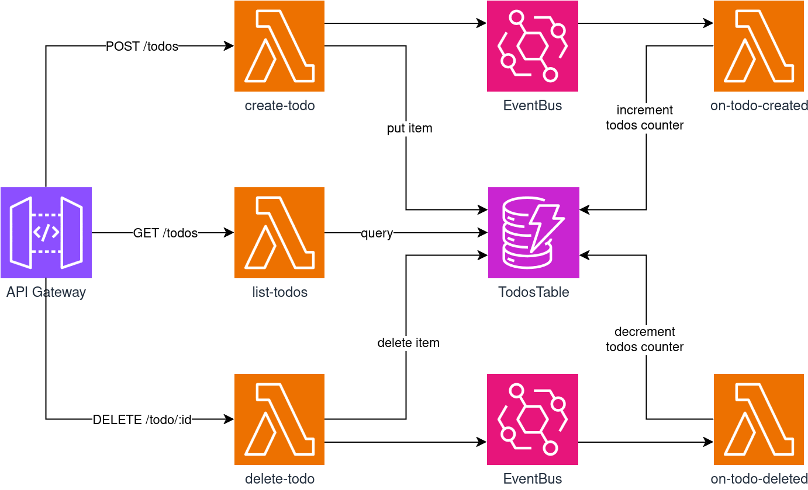

# Serverless CDK Rust

A sample serverless app with Rust. I'm just experimenting stuff here so don't take anything at face value 🙃.

## Features

Current features:

- ✅ Synchronous lambdas
- ✅ Asynchronous lambdas
- ✅ IAC unit tests
- 🕑 Lambda unit tests
- ✅ Integration tests
- ✅ Preview environments
- ❌ Frontend

## Overview

A **very** simple todo API to create, retrieve and delete todos. No front for now.

This is the architecture schema:



## Setup

### Requirements

**NodeJS**: See [official NodeJS install docs](https://nodejs.org/en/learn/getting-started/how-to-install-nodejs). The current NodeJS version is stored in `.nvmrc`. If you use `nvm`, you can run:

```bash
nvm use
```

**Pnpm**: dependency manager. Install with:

```bash
npm install -g pnpm
```

**Rust toolchain**: the Rust version is pinned in `rust-toolchain.toml`. Follow [the official install instructions](https://www.rust-lang.org/tools/install).

**Cargo Lambda**: in order to cross-compile Rust code to Lambda runtime. Follow [install instructions](https://www.cargo-lambda.info/guide/installation.html).

### Installation

Install NodeJS dependencies:

```bash
pnpm install
```

### AWS Setup

In order to deploy, you will need an AWS account. If you don't have one, refer to the AWS documentation.

Then install the AWS CLI: [install docs](https://docs.aws.amazon.com/cli/latest/userguide/getting-started-install.html).

Setup a local profile:

```bash
aws configure --profile <your-profile-name>
```

## Build & Deploy

### Build Rust Lambda code

```bash
pnpm build
```

### Run tests

```bash
pnpm test
```

### Deploy

⚠ Warning: you may have to log in to your AWS profile again, depending on the setup method.

```bash
pnpm run deploy --profile <your-profile-name>
```

### Run integration tests

```bash
pnpm test-integration
```
